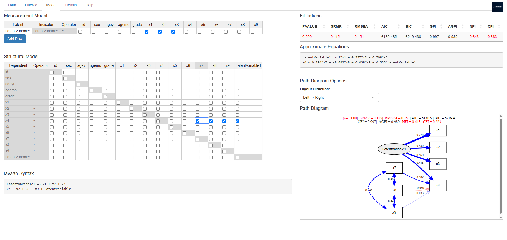

# Structura

**Structural Insights, Simplified.**
<br>


## Description

Structura is an interactive Shiny application for Structural Equation Modeling (SEM) in **R** ([r-project.org](https://www.r-project.org/?utm_source=chatgpt.com)), making it easy to upload data, specify models, and visualize results in a unified interface. It leverages the **lavaan** package for comprehensive latent variable analysis ([cran.r-project.org](https://cran.r-project.org/package%3Dlavaan?utm_source=chatgpt.com)).

## Features

* **Data Upload & Inspection**: Upload CSV files with automatic encoding handling via **readflex**.
* **Log-transform**: Apply common logarithm (log10) to positive numeric columns.
* **One-hot Encoding**: Convert categorical variables to dummy indicators for SEM compatibility.
* **Model Specification**: Define measurement (`Latent =~ Indicators`) and structural (`Dependent ~ Predictors`) models in interactive Handsontable grids powered by **rhandsontable** and **DT** ([cran.r-project.org](https://cran.r-project.org/package%3Dshiny?utm_source=chatgpt.com), [shiny.posit.co](https://shiny.posit.co/?utm_source=chatgpt.com)).
* **SEM Fitting**: Fit models using **lavaan** with support for mean structures and detailed fit measures.
* **Visualization**: Render path diagrams via **DiagrammeR**/**semDiagram**, and generate plots using **ggplot2** ([cran.r-project.org](https://cran.r-project.org/package%3Dggplot2?utm_source=chatgpt.com)).
* **Comprehensive Reporting**: View fit indices (p-value, SRMR, RMSEA, AIC, BIC, GFI, AGFI, NFI, CFI), parameter tables, and formatted equations in real time.

## Installation

Install required packages from github and CRAN:

```r
devtools::install_github("ToshihiroIguchi/semDiagram", dependencies = TRUE, upgrade = "never", build = FALSE, build_vignettes = FALSE)
devtools::install_github("ToshihiroIguchi/readflex", dependencies = TRUE, upgrade = "never", build = FALSE, build_vignettes = FALSE)
install.packages(c("shiny", "shinyjs", "DT", "rhandsontable", "lavaan", "DiagrammeR", "ggplot2", "reshape2", "markdown"))
```

## Launch Application

From your R console, run:

```r
shiny::runGitHub("Structura", "ToshihiroIguchi", ref = "main")
```

## Hosting the Shiny App Directly from GitHub

You can launch **Structura** straight from its GitHub repository and make it accessible across your LAN 
by automatically detecting your host’s IPv4 address and configuring Shiny’s host/port options. 
Place the following snippet in your `README.md` under a “Hosting” or “Development” section.

```r
# ── Packages ──────────────────────────────────────────────────
if (!requireNamespace("stringr", quietly = TRUE)) {
  install.packages("stringr")
}
library(stringr)
library(shiny)

# ── Function: Detect host IPv4 address ───────────────────────
get_ip <- function() {
  sysname <- Sys.info()[["sysname"]]
  
  if (sysname == "Windows") {
    # Run ipconfig and convert CP932 output to UTF-8
    raw   <- system("ipconfig", intern = TRUE)
    lines <- iconv(raw, from = "CP932", to = "UTF-8")
    
    # Grab the first line that contains the token "IPv4"
    ipv4_lines <- grep("IPv4", lines, value = TRUE, ignore.case = TRUE)
    line <- if (length(ipv4_lines) > 0) ipv4_lines[1] else ""
    
    # Fallback: use findstr if nothing was found
    if (!nzchar(line)) {
      line <- shell('ipconfig | findstr /i "IPv4"', intern = TRUE)[1]
    }
    
    # Final fallback: netsh provides a locale-independent label
    if (!nzchar(line)) {
      out  <- system("netsh interface ipv4 show ipaddresses", intern = TRUE)
      line <- grep("IP Address", out, value = TRUE)[1]
    }
    
    # Extract the IPv4 numeric pattern
    ip <- str_extract(line, "\\b(?:[0-9]{1,3}\\.){3}[0-9]{1,3}\\b")
    
  } else {
    # Linux / macOS: primary approach
    addr4 <- system("ip -4 addr", intern = TRUE)
    inet  <- addr4[grep("inet ", addr4)[1]]
    ip    <- sub(".*inet\\s+([0-9\\.]+)/.*", "\\1", inet)
    
    # Fallback: use routing information
    if (!nzchar(ip)) {
      rt <- system("ip route get 8.8.8.8", intern = TRUE)[1]
      ip <- str_extract(rt, "\\b(?:[0-9]{1,3}\\.){3}[0-9]{1,3}\\b")
    }
  }
  
  ip
}

# ── Configuration & launch ────────────────────────────────────
port    <- 8100
host_ip <- get_ip()
cat("Launching Structura on", host_ip, "port", port, "\n")

# runGitHub() cannot take host directly; set Shiny options
options(
  shiny.host = host_ip,
  shiny.port = port
)

# Launch Structura from GitHub
shiny::runGitHub(
  repo           = "Structura",
  username       = "ToshihiroIguchi",
  ref            = "main",
  launch.browser = FALSE,
  port           = port
)
```


## Image
<br>


## License

Released under the **MIT License** © 2025 Toshihiro Iguchi.

## Author

**Toshihiro Iguchi**
